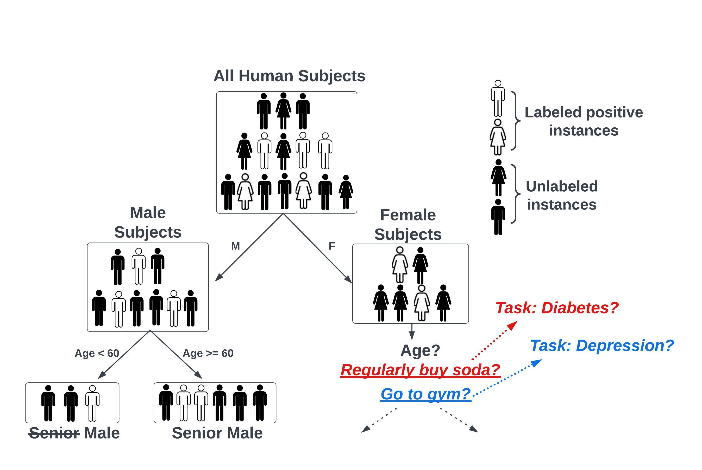
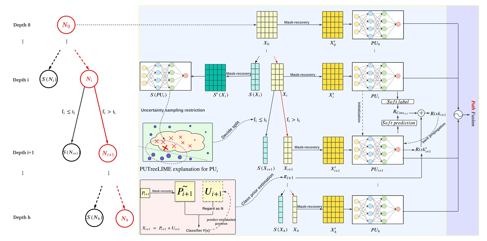

# [Community-Based Hierarchical Positive-Unlabeled (PU) Model Fusion for Chronic Disease Prediction](https://arxiv.org/abs/2309.03386)
[CIKM2023] Yang Wu, Xurui Li, Xuhong Zhang, Yangyang Kang, Changlong Sun, and Xiaozhong Liu
# Overview
This repository is the official implementation of PUtree and its variants.

# Method

Figure 1: A toy example of diabetes diagnosis for PUtree algorithm. PUtree uses PUTreeLIME to select optimal splitting criteria, and then builds PU model on each community. Based on instances’ landing node, PUtree aggregates information on all the PU models on the path to make prediction.


Figure 2: Illustration of our proposed PUtree network. We provide an example using the red tree path to showcase the PUtree algorithm. Specifically, we focus on the process of splitting from node 𝑁𝑖 to node 𝑁𝑖+1 and the corresponding sibling node represented by 𝑆 (𝑁𝑖+1). Notably, when the red path extends to meet the termination criteria, hierarchical path fusion is conducted, seamlessly integrating information from the root to the leaf PU models.

# Environment Set-up
```setup
conda env create -n putree -f putree.yml
conda activate putree

```
# Training and Evaluation

PUtree implementation:
```python
python putree_train.py --gpu --aug --fus
```

PUtree without fusion:
```python
python putree_train.py --gpu --aug
```

PUtree without augmentation:
```python
python putree_train.py --gpu --fus
```
PUtree without augmentation and --fusion:
```python
python putree_train.py --gpu
```
PUtree implementation global and local consistency contributor:
```python
python putree_train.py --gpu --aug --fus --dataset unsw --bet 0.1 --local_bet 0.9
```

PUtree implementation max_depth and min_node_size:
```python
python putree_train.py --gpu --aug --fus --dataset unsw --max_depth 2 --min_node_size 2000
```

PUtree implementation pu epoch and fusion epoch:
```python
python putree_train.py --gpu --aug --fus --dataset unsw --pu_epoch 100 --fusion_epoch 30
```
PUtree implementation on various datasets (default datset is unsw if no dataset specified, the output PUtree figure will be saved as dataset_putree.png):
```python
python putree_train.py --gpu --aug --fus --dataset unsw
python putree_train.py --gpu --aug --fus --dataset nsl_kdd
python putree_train.py --gpu --aug --fus --dataset diabetes
```


PUtree implementation pi selection method:
```python
python putree_train.py --gpu --aug --fus --pi gt
```

PUtree implementation on cpu:
```python
python putree_train.py --aug --fus
```
## References
[1] Marco Tulio Ribeiro, Sameer Singh, and Carlos Guestrin. 2016. " Why should i trust you?" Explaining the predictions of any classifier. In Proceedings of the 22nd ACM SIGKDD international conference on knowledge discovery and data mining. 1135–1144.


[2] Ryuichi Kiryo, Gang Niu, Marthinus C Du Plessis, and Masashi Sugiyama. 2017. Positive-unlabeled learning with non-negative risk estimator. Advances in neural information processing systems 30 (2017).


[3] Shuo Xu, Xin An, Xiaodong Qiao, Lijun Zhu, and Lin Li. 2013. Multi-output least-squares support vector regression machines. Pattern Recognition Letters 34, 9 (2013), 1078–1084.
